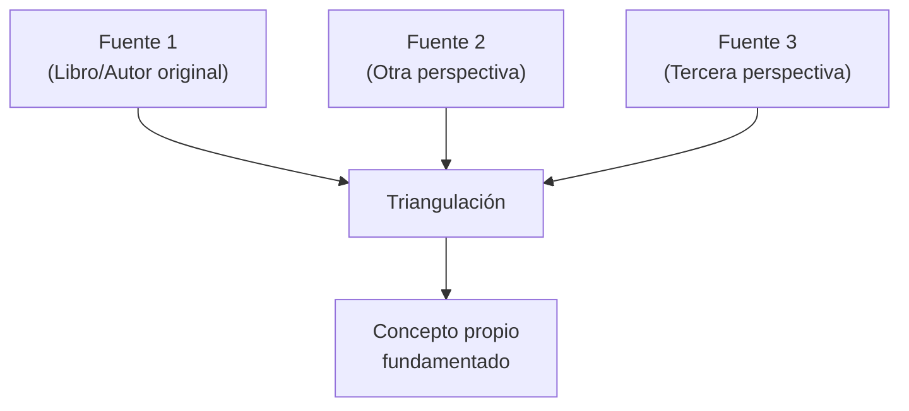

## Organización del Classroom y Materiales

El profesor comenzó la clase orientando a los estudiantes sobre la estructura del **Google Classroom** y los materiales disponibles:

### Sección: Introducción

En el subtítulo **Introducción** del Classroom, hay tres elementos principales:

1. **Materiales:** Dos diapositivas/presentaciones sobre pensamiento crítico, más una adicional titulada *"Lluvia de ideas"* (tema de esta clase)
2. **Clase 1, Actividad 1:** La actividad realizada en la primera clase (las hojas de quienes completaron la actividad ya están ahí)
3. **Diferencia entre ética y moral:** Contenido que se verá más adelante como parte de la introducción general

> **Profesor:** En ese subtítulo grande donde dice introducción, abajo dice materiales. Le dan ahí, lo activan, y le va a salir el material general: la diapositiva que ya empezamos a explicar la clase anterior. Ahí hay dos presentaciones de pensamiento crítico, y al ladito hay otra que se llama lluvia de ideas, que es lo que vamos a ver ahora.

> [!note] Contexto: Carnaval
> La segunda clase tuvo baja asistencia por la cuestión del carnaval.

### Sección: Elemento de Competencia 1

El **Elemento de Competencia 1** es la primera unidad general de la asignatura con una serie de contenidos. Los plazos son:

| Elemento | Contenido | Periodo |
| -------- | --------- | ------- |
| **Elemento de Competencia 1** | Primera unidad general | Hasta fines de marzo (+ examen parcial) |
| **Elemento de Competencia 2** | Segunda unidad general | Hasta comienzo de junio (fin de semestre) |

> **Profesor:** La materia está dividida en dos grandes partes. El elemento de competencia uno con su contenido y el elemento de competencia dos con también su contenido.

En la sección de **materiales** del Elemento de Competencia 1 hay videos, presentaciones y textos. El profesor indicó que seguirá aumentando materiales ahí y que los estudiantes deben **consultarlos y estudiarlos**.

> [!important] Contenidos del Elemento de Competencia 1
> Los lineamientos generales del pensamiento crítico:
> - El carácter **analítico** del pensamiento crítico
> - El carácter **reflexivo-filosófico** del pensamiento crítico
> - El carácter de **evaluación** (evaluar argumentos)

---

## ¿Qué es el Pensamiento Crítico?

### Definición como Capacidad

El profesor definió el pensamiento crítico como una **capacidad** con tres dimensiones:

1. **Capacidad para analizar** información y datos
2. **Capacidad para reflexionar** sobre la información
3. **Capacidad para evaluar** argumentos e información

> **Profesor:** El pensamiento crítico no aparece así nomás. No aparecemos de la noche a la mañana con pensamiento crítico. Es una capacidad, es un producto de una serie de desarrollo de habilidades.

Esas habilidades incluyen: distinguir qué elemento es verdadero vs. falso, construir argumentos dentro de un discurso, analizar situaciones.

### Alcance del Pensamiento Crítico

El pensamiento crítico **no se limita** a un área específica de conocimiento. Se aplica en tres niveles:

- **Personal/cotidiano**
- **Académico**
- **Profesional**

> **Profesor:** El pensamiento crítico engloba todas las acciones de la persona. Está ahí para tomar decisiones informadas.

### Material de Referencia

El profesor indicó que en el Classroom hay además otra presentación PDF titulada **"Pensamiento Crítico y Empoderamiento"**, con el subtítulo *"De la información a la toma de decisiones conscientes"*:

> **Profesor:** Muchas veces nosotros recibimos información, pero lo que hacemos es replicarla — solamente decirla de otra manera o repetirla. Pero tomar decisiones sobre esa información que hemos recibido, muy poco lo hacemos. Muy poco, porque no estamos capacitados para transformar esa información en una toma de decisión.

---

## Análisis de la Información

El análisis es un elemento fundamental y una **habilidad** del pensamiento crítico. El profesor presentó cuatro puntos clave para analizar información:

### 1. Distinguir Hechos y Opiniones

> **Profesor:** ¿Cuándo estamos frente a una opinión? ¿Cuándo estamos frente a un hecho como tal?

- **Opiniones:** Conocimientos que no son necesariamente verdaderos
- **Hechos:** Corresponden a conocimiento verdadero, verificable

### 2. Identificar Fuentes y Sesgos

Hay que identificar si la fuente es **confiable o no**, cuál es su **procedencia**, y si hay algún **sesgo** o **manipulación** en la información.

> [!example] Ejemplo: Inducción ideológica
> **Profesor:** Vamos a suponer que alguien te dice "lee este librito, está muy bueno, especialmente para todo lo que está pasando con el gobierno". Te da otra referencia. Y resulta que la persona te está induciendo y al mismo tiempo seduciendo para que leas marxismo, para que te metas en la economía marxista. ¿Para qué? Para que después puedas pertenecer a su grupo. Entonces, la información ya está **direccionada**: te está dando información para que saques una conclusión predeterminada.

### 3. Comparar Distintas Versiones (Triangulación)

El profesor explicó una técnica fundamental: la **triangulación** de perspectivas.

> **Profesor:** ¿Cómo yo sé que algo es verdad? Vamos a suponer que estoy leyendo un libro y el autor me da una afirmación, una hipótesis. La analizo, la entiendo, la comprendo. Pero necesito validar esa información. ¿Cómo la valido? Busco otra perspectiva, otro autor que me diga algo sobre el mismo tema. Y si tengo tiempo, busco una tercera perspectiva. Ya tengo un triángulo de perspectivas. Ya no me quedo con lo que me dice un solo libro; tengo dos más. De ahí tomo mi decisión, armo mi propio concepto. Eso es pensamiento crítico: **triangulizar**.

> [!tip] Técnica de triangulación
> No quedarse con una sola fuente. Buscar al menos **dos perspectivas adicionales** sobre el mismo tema. Comparar las tres, identificar constantes, y recién entonces armar el propio concepto.

> **Profesor:** De repente este libro "me la charló" — me quiso llevar a su molino. Pero el otro me dice algo más, lo veo más con pinzas, y el otro también. De las tres saco una constante y listo.

### 4. Cuestionar lo que se da por Hecho

> **Profesor:** Muchas veces damos por hecho lo que se nos dice. El pensamiento crítico tiene que cuestionar lo que se da por hecho. En este caso, cuestionar la norma. Les dan una normativa, una instrucción, y desde el punto de vista del pensamiento crítico, ustedes tienen que analizar esa norma para saber hasta qué punto es válida. Eso no significa "patear el tablero".

#### El Problema del Cuestionamiento en el Ámbito Laboral

> **Profesor:** A las instituciones no les agrada el cuestionamiento. A vos te dicen: "Esto hay que hacer y vos como caballo cochero tenés que hacer." No gusta, no agrada, no es cómodo la gente con pensamiento crítico.

El profesor planteó la pregunta: **¿Qué hace una persona con pensamiento crítico cuando no le permiten cuestionar en su lugar de trabajo?**

> **Estudiante:** Yo creo que podría dar una sugerencia al superior. Si uno encuentra algo que puede ser mejor o se puede hacer de otra manera, un camino más fácil, una persona con pensamiento crítico agarra, analiza todo el problema y luego sugiere al gerente cambiar la forma de cómo hacerlo. Y en caso de que el superior no quiera, no se puede hacer nada y hay que seguir las instrucciones.

> **Profesor:** Interesante. Mostrarle otra vía de procedimiento, otra alternativa, pero como sugerencia. Así no te ofendés, no quedás mal, pero proponés algo. Y en algún momento ellos lo van a ver y te van a llamar: "¿Por qué no me explicás esto mejor?" ¿Por qué? Porque vos te destacaste.

> [!note] Sugerencia vs. cuestionamiento directo
> El pensamiento crítico en el ámbito laboral no se ejerce "pateando el tablero", sino **proponiendo alternativas como sugerencias**. La persona con pensamiento crítico deja una propuesta sobre la mesa, de modo que eventualmente sea reconocida sin generar conflicto.

---

## Evaluación de la Información

### Valorar Credibilidad y Coherencia

El profesor preguntó a los estudiantes si alguna vez habían valorado la credibilidad y coherencia de la información recibida:

> **Estudiante:** Se hace más que todo cuando hay un trabajo en grupo y a una persona se le da cierta parte del trabajo. Uno tiene que valorar la coherencia de la información, ver si es afirmativa en correlación al trabajo del grupo sobre el tema. En el colegio también se valora mucho la información para construir un buen argumento y un buen trabajo.

### Revisión de Evidencias

> **Profesor:** Hay que revisar las evidencias porque algo se nos puede presentar como hecho, como verdadero. Nos ponen ahí la situación, la evidencia, pero tenemos que revisarla.

### Detectar Falacias

El profesor introdujo el concepto de **falacia**:

> **Estudiante:** Es como un argumento falso.

> **Profesor:** La falacia es un **falso razonamiento**. Parece verdadero, pero es falso. ¿Acaso no nos ocurre que en la vida cotidiana hemos escuchado a personas que nos hablan como si estuvieran diciendo la última maravilla del mundo? Sin embargo, están diciendo la última mentira. Nos están mintiendo, pero manejan tan bien el discurso que parece que nos dicen la última verdad.

> [!example] Ejemplo de falacia: Argumento de autoridad (Ad verecundiam)
> **Profesor:**
> - **Premisa 1:** "Yo tengo la verdad. Tienen que oírme a mí porque yo tengo la verdad."
> - **Premisa 2:** "¿Por qué tengo la verdad? Porque soy tu padre."
> - **Conclusión:** "Entonces, siempre las personas mayores, los padres, tienen la verdad."
>
> Esto es una **falacia**. ¿Es correcto que un padre siempre dice la verdad? No — "es verdad porque te lo digo yo, porque soy tu padre" no tiene argumento ni peso. No todas las personas siempre tienen la verdad. La premisa no está fundamentada.

---

## Reflexión sobre la Información

El pensamiento crítico tiene como elemento fundamental **reflexionar** sobre la información recibida. El profesor presentó cuatro puntos:

### 1. Relacionar con Experiencias Personales

> **Profesor:** Si la información que recibimos la relacionamos, la conectamos con nuestras experiencias, en ese momento estamos dando lugar a la reflexión.

### 2. Revisar Creencias Propias

> **Profesor:** Nuestras creencias a veces las llevamos para toda la vida. Nadie nos saca de nuestras creencias. No es fácil revisar nuestras creencias y mucho menos cambiarlas. ¿Por qué? Porque nos han dicho algo, hemos sido criados de cierta manera, y eso se convierte en una creencia arraigada.

> [!example] Ejemplo: Copiar y pegar la crianza
> **Profesor:** Una persona joven forma familia y dice "¿cómo voy a criar a mis hijos?". Fue criado de tal manera, entonces quiere trasladar la misma forma en que lo criaron. Copia y pega. Pero la pregunta es: ¿está correcto eso? No siempre es lo correcto. Generalmente, como no ha revisado esa creencia arraigada, repite patrones sin cuestionarlos.

> **Profesor:** Las creencias están arraigadas en nosotros mismos. Tenemos que revisarlas para posiblemente cambiarlas.

### 3. Considerar Consecuencias

> **Profesor:** Anticiparse a lo que pueden ser las consecuencias. Eso es muy atinado como parte del pensamiento crítico: adelantarse a la consecuencia.

### 4. Integrar Distintos Puntos de Vista

Es lo mismo que el profesor explicó con la **triangulación**: contrastar la información con al menos dos puntos de vista diferentes antes de considerarla válida.

---

## Capacidad de Argumentación

### Resumen vs. Síntesis

El profesor hizo una distinción importante entre **resumen** y **síntesis**:

> **Profesor:** Yo le digo "hay que hacer un resumen del texto de tal parte a tal parte." Todo el mundo sabe hacer un resumen. Listo, leo ese resumen y veo que en las primeras dos líneas ya están poniendo su opinión. El resumen permite poner nuestro lenguaje, armar la redacción en nuestro propio lenguaje, pero **idea propia: cero**. No tenemos permiso para poner nada nuestro en el resumen. Tengo que achicar solamente la información, nada más.

| Tipo | ¿Se puede incluir opinión propia? | Propósito |
| ---- | -------------------------------- | --------- |
| **Resumen** | **No** — solo reducir la información del autor | Hacer hablar al autor, no meter nada propio |
| **Síntesis** | **Sí** — ahora sí se mete la opinión propia | Integrar información con juicio personal |

> **Profesor:** ¿Cuándo va a estar bien un resumen? Cuando haga hablar al autor, cuando realmente utilice lo que dice el autor y no me meta yo para nada. Ahora, si me dicen "hacé una síntesis", ahora sí ya meto cuchara.

### Escuchar y Responder con Respeto

> **Profesor:** ¿Cuándo una persona no escucha ni responde con respeto a la otra persona?
> **Estudiantes:** Cuando está perdiendo la discusión.
> **Profesor:** Muy bien. Y eso significa que no tiene argumentos.

> **Estudiante:** Cuando vas perdiendo una charla, yo creo que lo más válido sería aceptar que la otra persona está en lo correcto. Pero el ser humano no hace eso porque vivimos en un ámbito de competitividad constante y eso hace que la persona que va perdiendo la discusión empiece a pelear.

> **Profesor:** Fíjate la capacidad de argumentación. Si yo tengo capacidad de argumentación, voy a mantener el equilibrio, la templanza. Versus el que no tiene argumentación: cuando ve que está perdiendo, no es capaz de controlarse. En realidad eso pasa mucho en la política.

> [!important] Señales de falta de argumentación
> Cuando una persona **pierde la calma, ataca personalmente, empieza a pelear** en lugar de debatir — es la señal evidente de que no tiene argumentos. La persona con capacidad de argumentación mantiene el equilibrio emocional; la que no tiene argumentos recurre a la agresión.

### Defender Ideas sin Imponer

> **Profesor:** En un debate, ¿de qué se trata? Se trata de desarmarlo al contrincante, quitarle las armas, pero **sin aniquilarlo** — es decir, sin ofenderlo. Quitarle las armas, pero sin aniquilar.

---

## Toma de Decisiones Coherentes

El profesor pidió a un estudiante leer los puntos de la presentación:

> **Estudiante:** Decidir con base en información analizada, actuar según valores propios, anticipar consecuencias, reducir decisiones impulsivas.

> **Profesor:** La persona que tiene pensamiento crítico no toma decisiones impulsivas. Decidir con base en información analizada significa que la decisión que voy a tomar es buena para el otro y buena para mí — buena interna y externamente.

| Componente | Descripción |
| ---------- | ----------- |
| **Decidir con base en información analizada** | La decisión es buena interna y externamente |
| **Actuar según valores propios** | Coherencia con principios personales |
| **Anticipar consecuencias** | Adelantarse a lo que puede ocurrir |
| **Reducir decisiones impulsivas** | Evitar reacciones no reflexionadas |

---

## Empoderamiento Personal

> **Estudiante:** Autonomía de pensamiento, confianza en el propio criterio, menor manipulación externa, y responsabilidad sobre las decisiones.

### "Conocimiento es Poder"

> **Profesor:** ¿Han escuchado la frase "conocimiento es poder"?

> **Estudiante:** La persona que tiene suficiente conocimiento siempre va a estar adelante en cualquier conversación, en cualquier debate, porque la información es el arma más poderosa del ser humano. Si tenés información, podés dominar cualquier charla o intervención.

El profesor desglosó los componentes del empoderamiento:

| Componente | Descripción |
| ---------- | ----------- |
| **Autonomía de pensamiento** | Tiene pensamiento propio |
| **Confianza en el propio criterio** | Sabe lo que está haciendo |
| **Menor manipulación externa** | No necesita manipular a otros para sobresalir; no necesita la debilidad de la otra persona |
| **Responsabilidad sobre las decisiones** | Asume la responsabilidad sobre lo que dice |

> **Profesor:** ¿Cuándo se empodera una persona? Cuando llega a tener manejo y dominio sobre algo en concreto, y en este caso, a nivel de conocimiento. Una persona empoderada es sólida en cuestión de principios: no necesita manipular a otros ni inventar trampas para que los demás caigan y ella sobresalga.

> [!important] Idea central
> Pensar críticamente permite **transformar la información en conocimiento y decisión**.

---

## Exposiciones: Actividad 1 — "¿Cómo sé que lo que sé es verdad?"

### Contexto de la Actividad

El profesor asignó la presentación de la **Actividad 1**, cuyo título es *"¿Cómo sé que lo que sé es verdad?"*. La actividad gira alrededor de un caso central:

> [!note] Caso: El Explorador Perdido en la Jungla
> Un explorador se pierde en una jungla y se encuentra con **dos lugareños** que hablan idiomas distintos:
> - **Nativo 1:** Afirma que sabe cómo salir de la jungla, pero se muestra **arrogante** y no escucha preguntas
> - **Nativo 2:** Parece **inseguro**, pero está dispuesto a **colaborar y escuchar**
>
> **Pregunta:** ¿A quién debería seguir el explorador y por qué?

Las preguntas de la actividad incluían:
1. ¿Qué factores consideras para decidir cuál opinión es más válida?
2. ¿Todas las opiniones tienen el mismo peso?
3. ¿Cómo podrían evitar que se tomen malas decisiones?
4. ¿Cómo influyen la curiosidad, la humildad intelectual, la apertura mental y la disposición al cambio en las decisiones?
5. ¿Nos consideramos más cercanos a la **Doxa** o a la **Episteme**?
6. Reflexión corta sobre la importancia del pensamiento crítico en la vida cotidiana

### Grupo 1: Diego, Samantha y Hugo

> **Estudiante (Hugo):** Comenzando con la primera pregunta, sobre qué factores consideramos para decir cuál opinión es más válida: el que lleva mayor confianza en la situación, ya que una persona que no está segura prefiere tener mayor seguridad hacia una persona determinada a tomar buenas decisiones, con una tonalidad de seguridad.

**Sobre si todas las opiniones tienen el mismo peso:**

> **Estudiante:** Dijimos que no, porque muchas personas tienen opiniones diferentes. La opinión de un docente hacia alguien que no tiene estudio — uno sabe que la opinión del docente tiene más peso, ya que lleva años de estudio, años en su carrera, y su opinión tiene más valor.

**Sobre el caso del explorador:**

> **Estudiante:** Al principio elegimos a la persona arrogante que nos iba a llevar directamente a la salida. Pero después llegamos a la conclusión de que sería mejor irnos con la persona que está dispuesta a escuchar, a ayudar y a buscar una salida juntos. Por llevarnos por un conocimiento breve, no podemos llegar a explorar lo que podemos conseguir junto al pensamiento de otra persona: **dos cabezas hacen mejor que una**.

**Sobre cómo evitar malas decisiones:**

> **Estudiante:** Teníamos que tomar una decisión con calma y un buen pensamiento generalizado. Si una persona toma decisiones rápidas, evidentemente puede estar errónea. Estando tranquilos es lo que más importa.

**Retroalimentación del profesor:**

> **Profesor:** Hay dos personajes: uno arrogante, todo hecho a sí mismo, y el otro más tranquilo, quizás más humilde. Es muy cotidiano encontrar este tipo de personas. Por la arrogancia, pareciera que tienen la verdad — hablan de manera arrogante, muy segura. Sin embargo, están diciendo la última ignorancia. El otro, que es más tranquilo, puede ayudar más.

### Grupo 2 (Grupo femenino)

> **Estudiante:** Llegamos a la conclusión de que deberíamos escuchar las opiniones de **todas** las personas porque es bueno siempre escuchar a otros, ya que tienen ideas distintas. También tenemos que tomar en cuenta el lugar en que estamos y ver si la información que nos dan es verdadera, o si la persona tiene experiencia en lo que está hablando. Después de escuchar todas las opiniones, podemos llegar a una sola conclusión basándonos en esas tres para que nadie se sienta excluido.

**Sobre el explorador:**

> **Estudiante:** Pensamos primero en el que decía saber el lugar, pero en sí no nos generaba confianza porque no iba a escuchar opiniones. El empático, aunque inseguro, nos iba a escuchar, nos iba a ayudar. Llegamos a la conclusión de que podríamos buscar más locales, porque si hay locales, hay más. Podemos pedir información y llegar a una conclusión conjunta. El objetivo no es quién tiene la razón o quién quiere imponer, sino encontrar una solución para salir.

> [!tip] Insight del Grupo 2
> La estrategia propuesta fue **ampliar las fuentes**: si hay lugareños disponibles, buscar más opiniones en lugar de depender de un solo informante. El objetivo no es imponer, sino encontrar una solución colaborativa.

### Grupo 3

> **Estudiante:** El proceso de pensamiento que obtuvimos fue que sabemos que algo es verdad a base de los **conocimientos previos** que tenemos y la **falta de argumentos en contra** de nuestra opinión. Si yo pienso que esa silla es amarilla, yo sé que es amarilla porque la estoy viendo; es algo factible, no puede haber argumento en contra.

**Sobre el sesgo de confirmación:**

> **Estudiante:** No tenemos que caer en uno de los errores más normales de las personas: solo buscar cosas que les afirmen lo que piensan. Si pienso que la gente no debería portar armas y solo busco información que muestre cuánta gente muere por armas, obviamente pensaría que son malas para la sociedad. Pero si también busco argumentos en contra de lo que yo pienso, puedo verificar y criticar mi propio pensamiento. Tenemos que basar nuestras verdades en lo que sabemos **y** en los conocimientos contrarios.

> [!important] Sesgo de confirmación
> Uno de los errores más comunes del ser humano es **solo buscar información que confirme lo que ya piensa**. El pensamiento crítico exige buscar también argumentos en contra de la propia posición y poner todo **en una balanza**.

**Sobre Doxa vs. Episteme:**

> **Estudiante:** Nos sentimos más cercanos a la **Episteme**, ya que es conocimiento basado en evidencias, mientras que la Doxa es conocimiento sin evidencia.

**Reflexión corta:**

> **Estudiante:** Para nosotros significa que tenemos que **analizar antes de reaccionar** — la mayoría de las personas reaccionamos primero y pensamos después. Evaluamos los consejos y opiniones antes de aceptarlos. El pensamiento crítico para tener una buena opinión personal se basa en **decidir con conciencia** en base a lo que analizamos y la información que tenemos.

### Grupo 4

> **Estudiante:** Estamos en una isla desierta y todos tienen diferentes ideas de cómo construir un refugio o conseguir alimento para escapar. Nuestro dilema: ¿escuchamos al que grita más fuerte o a quien tenga más confianza?

> **Estudiante:** No podemos guiarnos solo en quién tiene más confianza o quién grita más. Lo que tenemos que analizar es su **propuesta**: qué riesgo conlleva, qué viabilidad tiene. No podemos hacer un refugio muy grande si no tenemos suficiente madera, ni hacer un bote si es la única manera que tenemos para refugiarnos. Hay que analizar quién está hablando, qué propuestas está proponiendo, cómo lo está diciendo, y ver si esa persona tiene alguna experiencia previa en supervivencia.

**Sobre el explorador y los nativos:**

> **Estudiante:** El explorador tendría que pensar mucho en quién poner su seguridad y confianza. En el primero puede tener desconfianza porque, aparte de que no se entienden, puede llevarlo a una trampa. En el segundo, aunque esté dispuesto a colaborar, puede que no sepa la salida.

> **Estudiante:** Nosotros lo que haríamos sería — si pudiéramos entender el idioma de cada uno — preguntarle a cada uno. Si uno demuestra que no quiere responder ni escuchar preguntas, lo dejamos. El otro que está dispuesto a escuchar, le hacemos otra pregunta. Hay que identificar la **comunicación no verbal** de cada uno y basarse en eso.

**Retroalimentación del profesor:**

> **Profesor:** De repente el arrogante es muy elocuente, tiene palabra, una forma de comunicar impactante. Pero aparentemente dice la verdad solo por su manera de hablar. Y el otro, vamos a ver que no tiene mucha fluidez verbal, pero dice la verdad. Hay que ver el lenguaje, cómo se comunican con nosotros.

### Grupo 5

> **Estudiante:** El factor más importante primero sería **asegurar la supervivencia**. Antes de escapar de la isla, lo más factible sería priorizar vivir ese tiempo hasta encontrar una forma de salir. Primero hay que analizar la situación y ver qué opciones tienen más relevancia según el contexto.

**Sobre si todas las opiniones tienen el mismo peso:**

> **Estudiante:** No todas las opiniones tienen el mismo peso. Hay algunos que saben más que otros. Un docente ha estudiado por más tiempo y sabe de lo que habla, tiene años de experiencia, así que su opinión tiene más peso que la del estudiante. Puede equivocarse, pero es menos probable.

**Sobre cómo evitar malas decisiones:**

> **Estudiante:** Para no tomar malas decisiones, primero deberíamos analizar efectivamente la situación y descartar las ideas que tengan menor peso. Por ejemplo, los que simplemente querían escapar pero no estaban tomando en cuenta los recursos que tenían.

**Sobre curiosidad, humildad intelectual, apertura mental:**

> **Estudiante:** Influyen al momento de tomar decisiones. La curiosidad nos lleva a preguntar por qué estamos tomando esta decisión. La humildad intelectual incluye considerar las opiniones de los demás. La apertura mental y la disposición al cambio influyen para escuchar opiniones y aceptar que uno puede estar equivocado.

**Importancia del pensamiento crítico en la vida cotidiana:**

> **Estudiante:** Puede aplicarse en la toma de decisiones diarias, ya sean aleatorias o decisivas, tanto en la vida diaria como para el estudio y lo laboral.

**Sobre Doxa vs. Episteme:**

> **Estudiante:** Nos sentimos más cercanos a la **Episteme**, ya que es conocimiento con base en evidencias, mientras que la Doxa es conocimiento sin evidencia.

**Prioridades del grupo:**

> **Estudiante:** Nuestras prioridades serían enfocarnos en los factores exteriores, ya sea para dedicarle más tiempo al estudio o para el ámbito laboral.

---

## Cierre de Clase

Quedaron **dos grupos pendientes** de exponer para la siguiente clase. El profesor indicó que deben revisar su **Classroom** para mantenerse al día con los materiales y la interacción en plataforma.

> **Profesor:** Vayan a su Classroom, por favor. Esa es la interacción con ustedes y la plataforma.

Al final, durante la salida, hubo una conversación informal entre estudiantes:

> **Estudiante:** ¿Cómo les fue en clase de matemática?
> **Estudiante:** Feliz de la vida. Pasó el cálculo uno en medio de verano.
> **Estudiante:** La voy a dejar para el examen de matemáticas.
> **Estudiante:** Lo hizo a propósito. Quiero pasar el curso.
